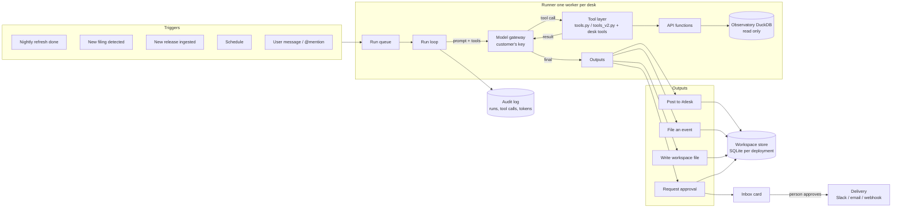

# Architecture of a specialist — the agent behind the Investment Assistant

> Companion to [PLAN-INVESTMENT-ASSISTANT.md](PLAN-INVESTMENT-ASSISTANT.md). Status: draft,
> 11 September 2026. Plain language first; the tables are for whoever builds it.

---

## 1. What a specialist is, in one paragraph

A specialist (Buyback Monitor, Coverage Clerk, Macro Briefer…) is **not a chatbot**. It is a
small, repeatable job: a written brief, a short list of tools it may call, a trigger that
starts it, a place it delivers to, and a memory of what it did last time. When its trigger
fires, a runner hands the brief and the task to a language model running on the
**customer's own model key**; the model works only by calling tools; the tools are the same
functions that serve the public API; everything the model does is written down; and
anything that would leave the desk stops and waits for a person. That is the whole design.
Every other section here is a consequence of it.

## 2. The picture



Two things never appear in this picture: a model we host, and a write path into the
Observatory's data files.

## 3. The parts

| Part | What it is | Exists today | New |
| --- | --- | --- | --- |
| **Specialist definition** | A folder: `brief.md` (the instructions), `manifest.json` (name, version, category, tools allowlist, triggers, workflows, delivery, model tier, budgets), example prompts. Versioned like software; the talent pool is a catalogue of these. | — | Yes. Nine definitions to write. |
| **Hire** | A per-desk copy of a definition plus the user's configuration: coverage list, rules, delivery targets, model choice. Updating a specialist = new definition version; the user accepts the update. | — | Yes |
| **Triggers** | What starts a run: the nightly refresh finishing (`start.sh` loop), a new filing for a covered name (equity extract diff), a new dataset release (ingest vintage change), a fixed schedule, a user message. | Nightly loop and ingest exist; they don't emit events yet. | A small "trigger bus": each source writes a row; the runner polls it. |
| **Runner** | A separate process (like `backfill.py`), one worker per desk, never inside uvicorn. Takes a run off the queue, builds the prompt, drives the tool loop, enforces budgets, writes the audit trail. | `agent.py` has the tool loop and OpenAI-compatible client. | Generalise the loop: any brief, any allowlisted tool set, budgets, run records. |
| **Model gateway** | One client for Anthropic and OpenAI-compatible endpoints. Reads the customer's key from an encrypted keychain, never from env. Counts tokens per run. | OpenAI-compatible client in `agent.py`. | Anthropic client; keychain; per-run accounting. |
| **Tool layer** | The 26 read tools in `tools.py` / `tools_v2.py`, plus **desk tools** (`my_coverage`, `my_rules`, saved screens, formula columns) and **action tools** (`post_to_desk`, `file_event`, `write_workspace_file`, `request_approval`). Action tools are the only way a run affects anything. | Read tools exist and serve MCP. | Desk tools and action tools; a per-specialist allowlist enforced by the runner, not by the prompt. |
| **Approval gate** | `request_approval` writes a pending row and ends the run. The Inbox shows the card. A person's approve/decline starts the delivery job. Nothing outward is ever sent by a run directly. | — | Yes. Fixed policy table (plan §3). |
| **Delivery** | Slack incoming webhook, email digest, generic webhook. Runs only from approved rows, or for the digest, from filed events. | — | Yes |
| **Memory** | Three kinds: thread memory (messages in one thread), workspace files (rules, coverage, notes the specialist wrote), and the last run's summary (handed to the next run as context). Never shared across desks. | — | Yes |
| **Audit** | Every run (trigger, specialist version, model, tokens, wall time, outcome) and every tool call (name, arguments, result hash, latency). Surfaces at Audit › Runs / Tools, and in `/api/v1/catalog/health` as a dataset-style freshness row. | `agent.py` records tool calls per answer. | Persist them; add the health row. |
| **Workspace store** | Its own SQLite file on the `data/` volume (Postgres later if needed). Holds users, keys, hires, runs, tool calls, events, approvals, threads, notes, files. | — | Yes. Never the macro or equity DuckDB files. |

## 4. One run, step by step

1. **A trigger fires.** The nightly equity refresh finishes and writes a row: `refresh_done`, with the list of filers whose data changed.
2. **The runner matches it.** For each desk, for each hired specialist whose manifest lists that trigger, it queues one run. Buyback Monitor on your desk gets a run because a covered name (Toyota) had a new monthly report.
3. **The prompt is built.** System = the specialist's brief plus the fixed trust rules (only numbers from tools; official vs derived; missing is never zero). Context = your coverage list, your rules, the summary of its last run, the trigger payload. Tools = its allowlist, and nothing else.
4. **The tool loop runs on your model key.** The model asks for `buyback/company 7203`; the runner calls the same function the API serves, records the call, returns the result. Repeat, up to the run's budget (default: 30 tool calls, 60k tokens, 5 minutes).
5. **The model acts through action tools.** It calls `file_event` (Toyota window closed, ¥684bn unspent, source S100YQ7I) and `post_to_desk` with the one-line verdict and the tool trail attached. Both land immediately; they never leave the desk.
6. **It asks before going outward.** Your rule says post to Slack, so it calls `request_approval` with the exact text. The run ends here with outcome "approval waiting".
7. **A person decides.** The Inbox card shows the text, the source and the trail. Approve → the delivery job posts it to Slack and records who approved it and when. Decline → recorded, nothing sent. Unanswered for 7 days → expires.
8. **The audit is complete.** Run row, six tool-call rows, token count, outcome. The health report shows the runner's last successful cycle, so a silent stall is visible.

If the model endpoint is down, the run fails and posts nothing. If a tool errors, the model sees the error and may finish with less; the outcome says so. If a budget is hit, the run stops and posts "couldn't finish", never a partial number presented as complete.

## 5. What the model can and cannot do

- **Can:** call allowlisted read tools; read its own workspace files; post to `#desk`; file events; write its own workspace files; ask for approval.
- **Cannot:** call a tool outside its allowlist (the runner refuses, whatever the prompt says); reach the internet; run code; read another desk; send anything outward itself; touch an execution or order tool, because none exists in the tool layer and the manifest schema has no slot for one.

The allowlist is enforced in the runner, not by asking the model nicely. That is the difference between a policy and a hope.

## 6. Data model, briefly

```
users(id, email, firm_id, role)
keys(user_id, kind: observatory|anthropic|openai, ciphertext, last4, created)
specialists(slug, version, manifest_json, brief_md, sha256)              -- the catalogue
hires(id, desk_id, specialist_slug, version, config_json, enabled)
triggers(id, kind, payload_json, fired_at, consumed_at)
runs(id, hire_id, trigger_id, model, started, ended, tokens_in, tokens_out, tool_calls, outcome)
tool_calls(id, run_id, name, args_json, result_sha256, ms, error)
events(id, desk_id, run_id, dataset, sec_code|series, kind, text, source_json, vintage_id)
approvals(id, run_id, action, payload_json, status, decided_by, decided_at, expires_at)
posts(id, desk_id, run_id|user_id, text, refs_json, created)
threads(id, desk_id, hire_id, title) / messages(thread_id, role, text, tool_calls_json)
files(id, hire_id, path, sha256, updated)
```

Every event and every post carries `source_json` (document id, release id, SHA-256, URL) and
a `vintage_id`. A number without a source cannot be stored; the action tools reject it.

## 7. Where it runs

- Same container as today. The runner starts after the API, as `backfill.py` does, and is
  killed first on shutdown. One worker per desk keeps runs serial per user; desks run in
  parallel up to a small cap.
- Reads Plover Analytics DuckDB files read-only, through the API functions. Writes only to
  the workspace SQLite. Guardrail 5 (one DuckDB writer, never the serving process) holds.
- Egress allowlist for the runner: the model endpoints, Slack, the email provider, and MCP
  servers the firm admin registered. Nothing else.
- Python 3.9 locally and 3.12 in production, as for all `app/` code; the MCP SDK is not
  used for the same reason `mcp.py` avoids it.

## 8. Cost, roughly

A nightly run of one specialist over five names is about 20–60k tokens: a few yen on the
customer's key. Three specialists nightly for a month is a rounding error against the
subscription. Because the key is theirs, model cost never appears on our invoice and never
becomes our margin problem; we charge for the desk, the tools and the audit.

## 9. Open decisions

- Our own runner (small, serial, polling) versus a hosted agent runtime per workspace.
  Recommendation: own runner first; the workload is tiny and the audit is simpler.
- Whether firms may edit a specialist's brief ("Build a specialist"). Recommendation: not
  in v1; configuration yes, prompt editing no, so every hired specialist is a version we
  can support.
- Thread memory limits and retention (plan §9 "Data retention").
- Which Anthropic and OpenAI models are offered per tier (worker vs reviewer).
